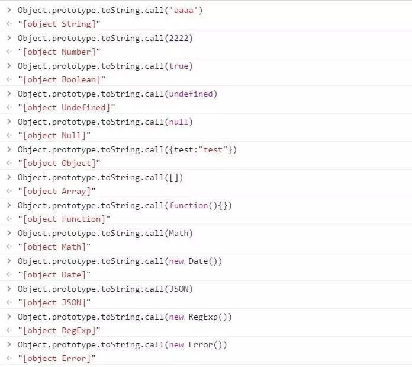

# 一.javascript 基础知识部分

### 1. 数据类型：

-   ECMAScript 的基本数据类型有 5 种： Undefined、Null、Boolean、Number、String。其中 Boolean、Number、String 属于原始类型，Undefined、Null 属于原始值。原始类型代表了各自类型的所有成员，原始值则代表了各自特殊类型的唯一成员。

-   ECMAScript 的复合数据类型有 1 种：Object（对象类型）。

> ECMAScript 的特殊对象类型：Array、Function、Math、Date、JSON、RegExp、Error，每种类型都各自代表一种独立的类，不同的类实例拥有不同的类特性以及对应的操作方式。

### 2.判断数据类型的方法：

-   typeof
    > typeof 的返回值类型有 6 种 ，分别为 number、string、boolean、object、function、undefined

```
<!-- 如果判断 -->
```


