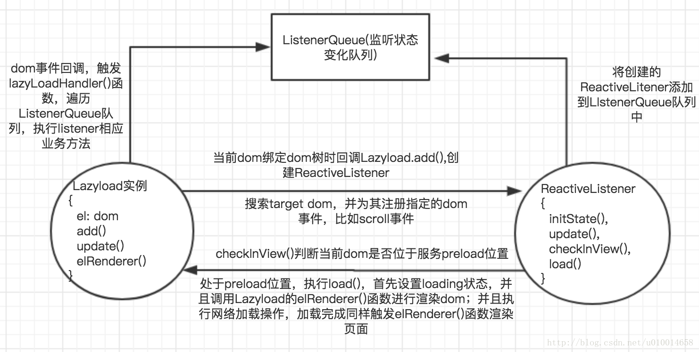

详情请参考：[Vue-lazyload 原理详解之源码解析](https://blog.csdn.net/u010014658/article/details/73477232)

## 原理剖析

原理简述：

1. vue-lazyload 是通过指令的方式实现的，定义的指令是 v-lazy 指令

2. 指令被 bind 时会创建一个 listener，并将其添加到 listener queue 里面，并且搜索 target dom 节点，为其注册 dom 事件（如 scroll 事件）

3. 上面的 dom 事件回调中，会遍历 listener queue 里的 listener,判断此 listener 绑定的 dom 是否处于页面中 perload 的位置，如果处于则加载异步加载当前图片的资源。

4. 同时 listener 会在当前图片加载的过程的 loading,loaded,error 三种状态触发当前 dom 渲染的函数，分别渲染三种状态下 dom 的内容。
