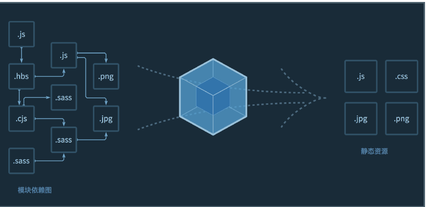
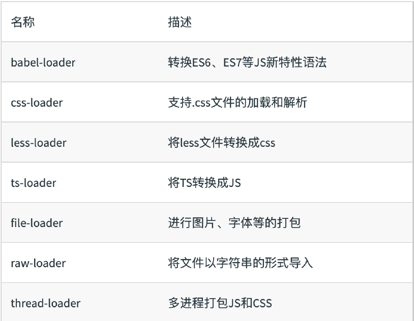
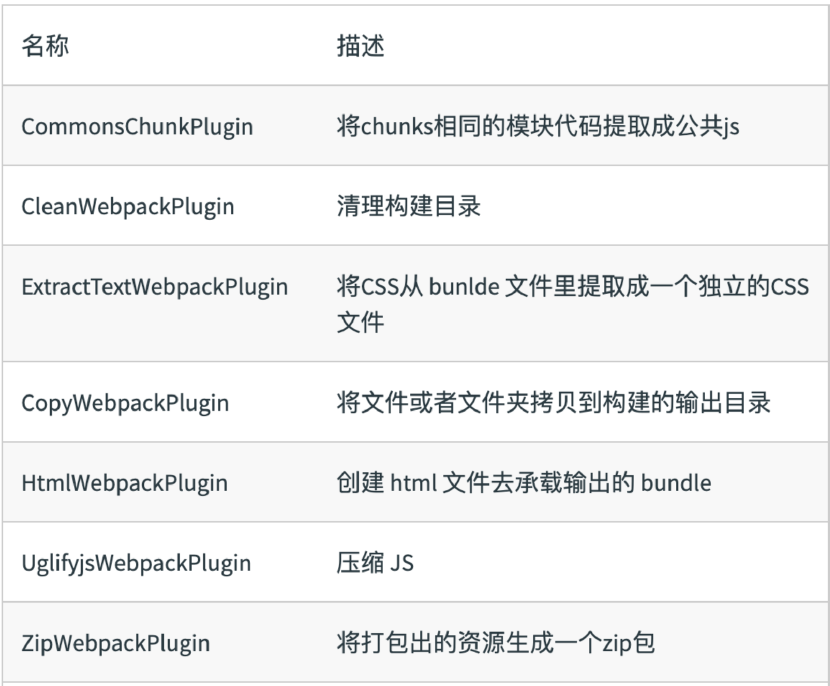
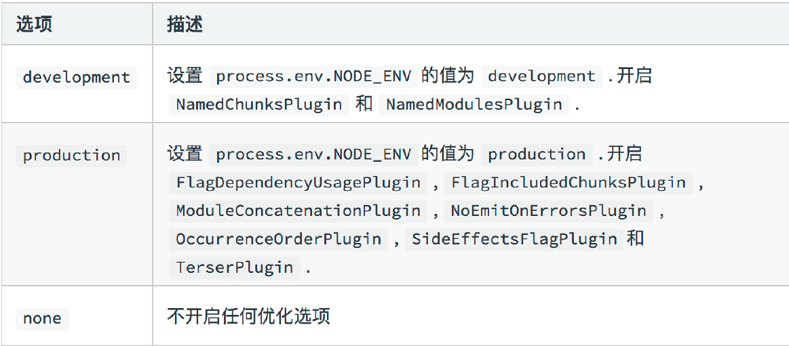
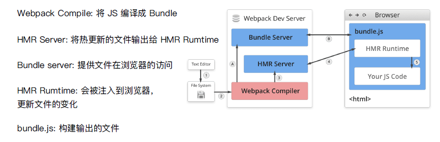
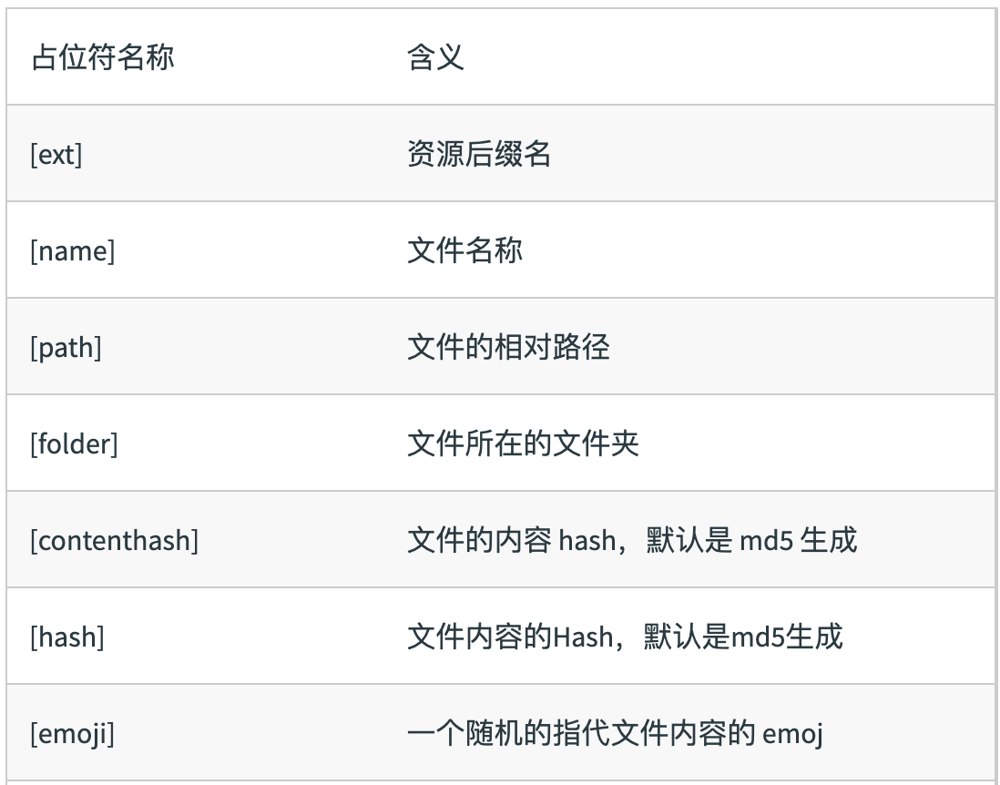

# webpack 整理

## 初识webpack

- 配置文件名称
  - webpack默认配置文件：webpack.config.js
  - 可以通过webpack --config指定配置文件

- webpack配置组成

```js
  module.exports = {
    entry: './src/index.js', // 1.打包入口文件
    output: './dist/main.js', // 2.打包的输出
    mode: 'production', // 3.环境
    module: {   // 4.loader配置
      rules: [
        {
          test: /\.txt$/,
          use: 'raw-loader'
        }
      ]
    },
    plugins: [ // 5.插件配置
      new HtmlWebpackPlugin({
        template: './src/index.html'
      })
    ]
  }
```

- 环境搭建

我们可以直接安装node.js 也可以通过安装nvm来管理不同版本的node.js

- 开始项目搭建

  1.创建空目录和package.json

  ```js
    mkdir my-project
    cd my-project
    npm init -y
  ```

  2.安装webpack 和 webpack-cli

  ```js
    npm install webpack webpack-cli --save-dev
  ```

  3.编写一个简单的例子

  webpack配置：

  ```js
    const path = require('path');

    module.exports = {
      entry: './src/index.js',
      output: {
        path: path.resolve(__dirname, 'dist'),
        filename: 'bundle.js',
        publicPath: '/' //资源请求路径
      }
    }
  ```

  修改package.json;

  ```json
    {
      "name": "hello-webpack",
      "version": "1.0.0",
      "description": "Hello webpack",
      "main": "index.js",
      "scripts": {
      "build": "webpack" //添加
      },
      "keywords": [],
      "author": "",
      "license": "ISC"
    }
  ```

  编写js省略

## webpack 基础⽤用法

### 核心概念之Entry

> Entry 来指定 webpack 的打包入口



依赖图的入口是entry

对于非代码比如图片、字体依赖也会不断加入到依赖图中
 
#### Entry 的用法

- 单入口：entry是一个字符串

```js
module.exports = {
  entry: './src/index.js'
}
```

- 多入口：entry是个对象

```js
module.exports = {
  entry: {
    index: './scr/index.js',
    app: './src/app.js'
  }
}

```

### 核心概念之Output

> Output用来告诉webpack如何将编译后的文件输出到磁盘

- Output的用法：单入口配置

```js
  module.exports = {
    entry: './src/index.js',
    output: {
      path: path.join(__dirname,'dist'),
      filename: 'bundle.js'
    }
  }
```

- Output的用法：多入口配置

```js
  module.exports = {
    entry: './src/index.js',
    output: {
      path: path.join(__dirname,'dist'),
      filename: '[name].js' // []通过占位符确保⽂文件名称的唯⼀一
    }
  }
```

### 核心概念之Loaders

> webpack开箱即用只支持JS和JSON两种文件类型，通过Loaders去支持其他文件类型并且把它们转化成有效的模块，并且可以添加到依赖图中

本身是一个函数，接受源文件作为参数，返回转换的结果

> 常见的Loaders有哪些？



- Loaders的用法

```js
const path = require('path');
module.exports = {
  output: {
    filename: 'bundle.js'
  },
  module: {
    rules: [
      {
        test: /\.txt$/, // test 指定匹配规则
        use: 'raw-loader' // use指定使用的loader名称
      }
    ]
  }
}
```

### 核心概念之Plugins

> 插件用于bundle文件的优化，资源管理和环境变量注入，作用于整个构建过程

> 常见的Plugins有哪些？



- Plugins的用法

```js
const path = require('path');
module.exports = {
  output: {
  filename: 'bundle.js'
  },
  plugins: [
    new HtmlWebpackPlugin({template:'./src/index.html'})
  ]
};
```

### 核心概念之Mode

> Mode用来指定当前的构建环境是：production、development还是none

设置mode可以使用webpack内置的函数，默认值为production

- Mode的内置函数功能



### 资源解析

#### 解析ES6

使用babel-loader

babel的配置文件是：.babelrc

```js
module.exports = {
  module: {
    rules: [
      {
        test: /\.js$/,
        use: 'babel-loader'
      }
    ]
  }
}
```

```json
{
  "presets": [
    "@babel/preset-env" //增加ES6的babel preset配置
  ],
}
```

- 解析React JSX

```json
{
  "presets": [
    "@babel/preset-env", //增加ES6的babel preset配置
    "@babel/preset-react" //增加React 的babel preset 配置
  ],
}
```

#### 解析CSS

css-loader⽤用于加载.css ⽂文件，并且转换成commonjs 对象

style-loader 将样式通过`<style>` 标签插⼊入到head 中

```js
module.exports = {
  module: {
    rules: [
      {
        test: /\.css/,
        use: [
          'style-loader',
          'css-loader'
        ]

      }
    ]
  }
}
```

webpack的loader是从右向左执行。css-loader处理完毕的数据交给style-loader。注意写法顺序。

#### 解析Less和Sass

less-loader ⽤用于将less 转换成css

```js
module.exports = {
  module: {
    rules: [
      {
        test: /\.less$/,
        use: [
          'style-loader',
          'css-loader',
          'less-loader'
        ]
      }
    ]
  }
}
```

#### 解析图片和字体

file-loader ⽤用于处理理⽂文件

```js
module.exports = {
  module: {
    rules: [
      {
        test: /\.(png|svg|jpg|gif)$/,
        use: [
          'file-loader'
        ]
      },
      {
        test: /\.(woff|woff2|eot|ttf|otf)$/,
        use: [
          'file-loader'
        ]
      }
    ]
  }
}
```

#### 使用 url-loader

> url-loader 也可以处理理图⽚片和字体可以设置较⼩小资源自动base64

```js
module.exports = {
  module: {
    rules: [
      {
        test: /\.(png|svg|jpg|gif)$/,
        use:[
          {
            loader: 'url-loader’,
            options: {
              limit: 10240
            }
          }
        ]
      }
    ]
  }
}
```

#### webpack 中的文件监听

> 文件监听是在发现源码发生变化时候，自动重新构建出新的输出文件。

webpack开启监听模式，有两种方式：

- 启动webpack命令时，带上 --watch参数
- 在配置webpack.config.js中设置watch: true

唯一缺点：每次需要手动刷新浏览器

- 文件监听原理分析

轮询判断文件的最后编辑时间是否发生变化

```js
module.export = {
  //默认false，也就是不不开启
  watch: true,
  //只有开启监听模式时，watchOptions才有意义
  watchOptions: {
    //默认为空，不监听的文件或者文件夹，支持正则匹配
    ignored: /node_modules/,
    //监听到变化发生后会等300ms再去执行，默认300ms
    aggregateTimeout: 300,
    //判断文件是否发生变化是通过不停询问系统指定文件有没有变化实现的，默认每秒问1000次
    poll: 1000
  }
}

```

#### 热更新实现1 webpack-dev-server

WDS 不不刷新浏览器器

WDS 不不输出⽂文件，⽽而是放在内存中

使⽤用HotModuleReplacementPlugin插件

package.json中配置

```json
{
  "scripts": {
    "dev": "webpack-dev-server --open"
  }
}
```

webpack.config.js配置

```js
module.exports = {
  plugins: [
      new webpack.HotModuleReplacementPlugin()
  ],
  devServer: {
      contentBase: './dist',
      hot: true
  }
}

```

#### 热更新实现2 webpack-dev-middleware

WDM 将webpack 输出的⽂文件传输给服务器器

适⽤用于灵活的定制场景

```js
const express = require('express');
const webpack = require('webpack');
const webpackDevMiddleware = require('webpack-dev-middleware');
const config = require('./webpack.config.js')
const app = express();
const compiler = webpack(config);

app.use(webpackDevMiddleware(compiler, {
    publicPath: config.output.publicPath
}));

app.listen(3000, function () {
    console.log('Example app listening on port 3000!\n');
});
```

#### 热更更新的原理理分析



#### 文件指纹

> 文件指纹就是打包后输出的文件名的后缀

- Hash:和整个项⽬目的构建相关，只要项⽬目⽂文件有修改，整个项⽬目构建的hash 值就会更更改
- Chunkhash:和webpack 打包的chunk 有关，不不同的entry 会⽣生成不不同的 chunkhash 值
- Contenthash：根据⽂文件内容来定义hash,⽂文件内容不不变，则 contenthash 不不变

##### JS的⽂文件指纹设置

> 设置output 的filename，使⽤用`[chunkhash]`

```js
module.exports = {
  output: {
    filename: '[name]_[chunkhash:8].js'
  }
}
```

##### CSS的⽂文件指纹设置

设置MiniCssExtractPlugin 的filename，使用`[contenthash]`

```js
module.exports = {
  plugins: [
    new MiniCssExtractPlugin({
      filename: `[name][contenthash:8].css`
    })
  ]
}
```

##### 图⽚片的⽂文件指纹设置

设置file-loader 的name，使⽤用`[hash]`



```js
module.exports = {
  module: {
    rules: [
      {
        test: /\.(png|svg|jpg|gif)$/,
        use: [
          {
            loader: 'file-loader',
            options: {
              name: 'img/[name][hash:8].[ext]'
            }
          }
        ]
      }
    ]
  }
}
```

### 代码压缩

#### JS文件的压缩

内置了uglifyis-webpack-plugin

#### CSS文件的压缩

使用optimize-css-assets-webpack-plugin,同时使用 cssnano

```js
module.exports = {
  plugins: [
    new OptimizeCssAssetsPlugin({
      assetNameRegExp: /\.css$/g,
      cssProcessor: require('cssnano')
    })
  ]
}
```

#### HTML文件的压缩

修改html-webpack-plugin，设置压缩参数

```js
module.exports = {
  plugins: [
    new HtmlWebpackPlugin({
      template: path.join(__dirname, 'src/search.html'),
      filename: 'search.html',
      chunks: ['search'],
      inject: true,
      minify: {
        html5: true,
        collapseWhitespace: true,
        preserveLineBreaks: false,
        minifyCSS: true,
        minifyJS: true,
        removeComments: false
      }
    })
  ]
}
```
